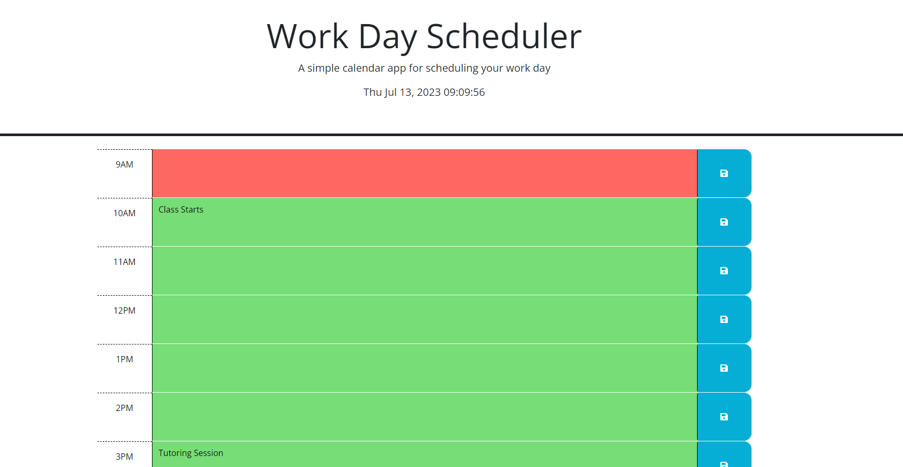

# Work Day Schedule

## Activity

- This is a work day scheduler for people to use to help plan and manage their daily work load. 
- Information that you type can be saved locally and it is color coded so users can easily see what time of the day it is.

## User Instructions

- Type in your work for any given hour block.
- Hit the blue save button. This will save your information locally.
- Refresh the page and your work will still be there!
- The hour blocks will update their color based on the current time. 
- Gray = past time
- Red = current time
- Green = future time

## Screenshot

- Here is a screenshot of the working webpage.

## Working Code

- Here is a link to a working version of my code:
[Work Day Schedule](https://laurbaur024.github.io/work-day-scheduler/)